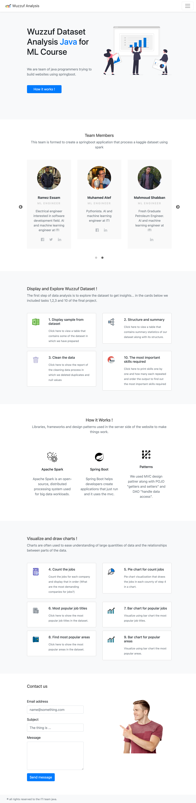

## 🤔 Installing and Running the project

To install the project you just need to `clone` it then `build` and `run` using your favourite
ide. <br>

Note that:
* Kindly make sure you have java `1.8` installed on your machine
* If you faced any errors while building or running please go to `pom` file then `install maven dependencies` from there.

<br>

### 📊 Wuzzuf Dataset Analysis

Final java for machine learning course project

This is the final project of the Java for machine learning course in the ITI Scholarship -AI Intake 2.

<br>

### 💻 Dataset used from Kaggle

The data set used in this project was provided by Wuzzuf jobs in Egypt data set at Kaggle :
https://www.kaggle.com/omarhanyy/wuzzuf-jobs

<br>

### 🚀 Project Specification
> The project purpose was to build all java needed classes (POJO , DAO, web service and a tester client for the web service) and Make a web service to get the following:

1) Read data set and convert it to dataframe or Spark RDD and display some from it.  
2) Display structure and summary of the data.
3) Clean the data (null, duplications)
4) Count the jobs for each company and display that in order (What are the most demanding companies for jobs?)
5) Show step 4 in a pie chart
6) Find out What are it the most popular job titles?
7) Show step 6 in bar chart
8) Find out the most popular areas?
9) Show step 8 in bar chart
10) Print skills one by one and how many each repeated and order the output to find out the most important skills required?

<br>


### 📝 Dataset includes

<br>

| Attribute | Type   | Description                                  |
|-----------|--------|----------------------------------------------|
| title     | String | All the job titles of the dataset for ran    |
| company   | String | The company he works in                      |
| location  | String | Where that company is located                |
| type      | String | Type of the employment ex: full-part         |
| level     | String | The level of the job.                        |
| yearsExp  | String | How many years of expierence he has          |
| country   | String | The country or city that job is located      |
| skills    | String | A list of all the skills he has for this job |

<br>

### 💁 What You're Getting
```bash
├── src
├────── main
├─────────── java
├──────────────── bootStrapData
├──────────────── controllers
├──────────────── model
├──────────────── repository
├─────────── resources
├──────────────── static
├────────────────────── css
├────────────────────── images
├────────────────────── js
├──────────────── templates 

```

<br>


### 👬 Contributing - Team members
1) `Ramez Essam `
2) `Mohamed Atef Fahmy `
3) `Omar Hamed Marie `
4) `Mahmoud Shaaban`


### 👨🏼‍🏫 Contributing -  Supervisor
`Mr. Amr El-Shafey`

<br>

### 📸 Wireframe
<br>


<br/>
